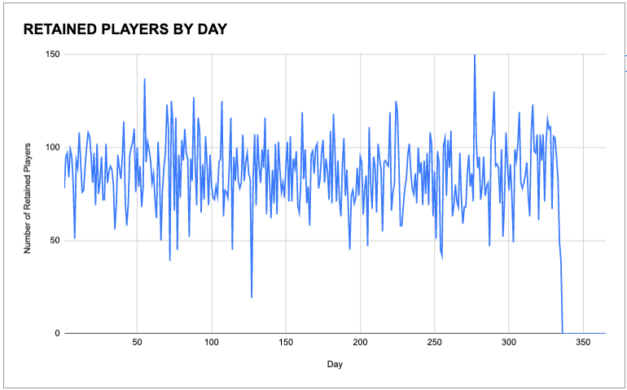
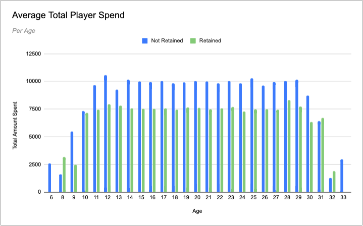
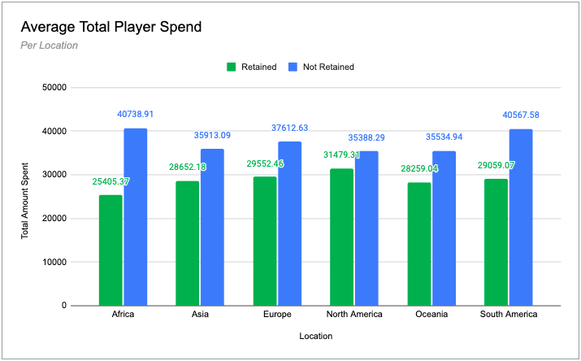

# Game Company Analysis Project
# *Background*

For this project, we were hired by a mobile gaming company to answer the following questions with regards to 30-day retention for their anniversary:

1. *Is 30-day rolling retention increasing or decreasing over the lifecycle of the game?*
2. *Do retained players on average spend more on the game items than non-retained players?*

The company provided us with 4 existing tables to aid in this analysis which included the following information: 

- **Player information:** including player's age and when their date joined
- **Match information:** including the player match information(day, id), and match outcome
- **Purchase information:** including purchase date and which players bought which items 
- **Item information:** including the item ID and the price

With these provided tables, we were able to answer the above-requested questions with the following SQL queries. 

# *SQL Queries*
### **QUERY 1:** *Retention Table*

This query uses the provided tables “match_info” and “player_info” joined together and results in a table that includes 4 columns that reflect the following: 

1. The day of the year the player joined 
2. the number of players who joined on that day 
3. the total amount of players who are retained 
4. The fractional retention rate

### **QUERY 2:** *Average Spend Table*

This query returns the average spend of players by age, retention status (spend by retained vs not retained players), and locations below. It is accomplished by joining an additional table into the final retention table and then utilizing a subquery from that table which is then joined to the last item_info table. This wealth of information will allow further analysis and visualization in Google Sheets. 

# **Analysis of 30 Day Retention: 1 Year Life-Cycle**

### *Q1: Is 30-day rolling retention increasing or decreasing over the lifecycle of the game?*
---
When investigating the data output in the spreadsheet we can see that the retention rate is fairly steady over the lifecycle of the game with a few day spikes such as exhibited on Day 55 where 137 players were retained. Additionally, the visualization clearly showcases the highest spike of the year which occurred on Day 277 with 150 players retained. The graph also shows a large drop in player retention on Day 127 where only 19 players were retained which is the lowest rate of the year. Lastly, the limitation of the data is displayed in this visualization as we can see there is a sudden drop off of retention from Day 336 onwards. Since this query only considers players as a “retained” status if they had played a match for 30 days however these players would not be able to play a match within 30 days before the year is completed. 

---

### *Q2: Analysis of Average Total Player Spend: By Age and By Country*
---
For additional analysis, we decided to investigate the average spending habits of retained players vs not retained players by both age and country. In the graphs created it is displayed that the average total spent on the game is higher by non-retained players of most age groups which the exception of the ages of 31 and 32.

When looking at the average total spending of non-retained players compared to retained players by country, we can again see that non-retained players spend more on average than retained players with Africa having the highest average spend as well as the largest difference between the average spend of retained and non-retained players. Comparatively, North America has the smallest difference between the average spending of retained and non-retained players. 

Link to raw data and visualizations [Click here](https://docs.google.com/spreadsheets/d/13_7qYvvgnYuCScGAuoPgzHc_byxxTu7Z5PifQk5EJ4g/edit?usp=sharing)

